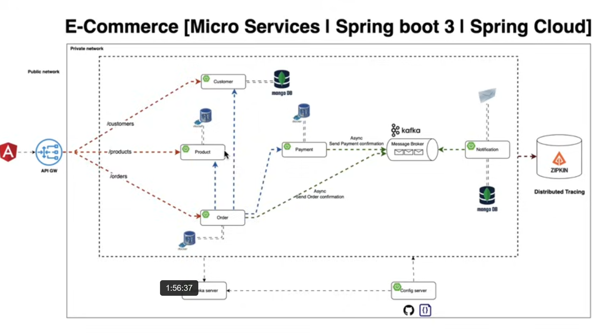
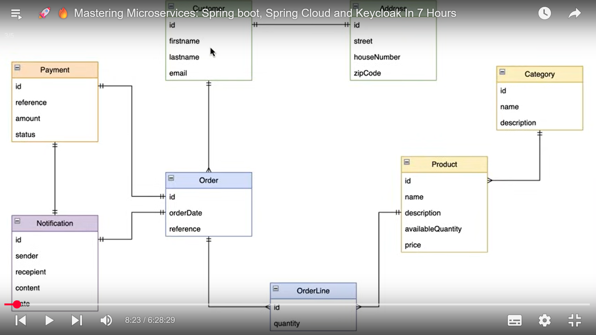

# Microservices Architecture with Spring Boot, Spring Cloud & Keycloak
 

This project demonstrates a **complete microservices-based architecture** built using **Spring Boot**, **Spring Cloud**, **Apache Kafka**, **Docker**, and **Keycloak**.  
It implements both **synchronous and asynchronous communication**, **distributed tracing**, **centralized configuration**, and **secure authentication** — all within a production-grade setup.

---

## Architecture Overview

The system is composed of multiple microservices communicating over REST and Kafka:

- **Configuration Server** – Centralized configuration management for all services.  
- **Discovery Server (Eureka)** – Service registry and discovery.  
- **API Gateway** – Entry point to all backend services; routes and secures API traffic.  
- **Customer Service** – Handles user data and customer-related operations.  
- **Product Service** – Manages product information and database persistence.  
- **Order Service** – Processes customer orders, communicates with Product and Payment services.  
- **Payment Service** – Handles payment validation and completion of transactions.  
- **Notification Service** – Sends asynchronous notifications upon successful order placement.

---

##  Core Features Implemented

###  Domain-Driven Design (DDD)
- Applied **DDD principles** to separate the domain logic, infrastructure, and application layers.  
- Each microservice contains its own **bounded context**, ensuring modularity and scalability.

###  Communication Patterns
- **Synchronous communication** via **OpenFeign** and **RestTemplate** for inter-service REST calls.  
- **Asynchronous communication** using **Apache Kafka** for order confirmations and notifications.  

###  Security
- Integrated **Keycloak** for identity and access management.  
- Configured **OAuth2 & JWT-based authentication** for securing APIs via the API Gateway.  

###  Containerization
- All services are containerized using **Docker**.  
- **Docker Compose** orchestrates the complete infrastructure:
  - Zookeeper & Kafka  
  - Postgres Databases  
  - Zipkin for tracing  
  - Keycloak for security  

###  Distributed Tracing & Monitoring
- Integrated **Zipkin** for distributed tracing of requests across microservices.  
- Exposed **Spring Actuator** metrics for system monitoring.

###  Exception Handling & Validation
- Global error handling using `@ControllerAdvice`.  
- Custom exceptions for validation, business logic, and runtime issues.

---

##  Tech Stack

| Category | Technologies |
|-----------|--------------|
| **Backend Framework** | Spring Boot, Spring Cloud |
| **Service Communication** | OpenFeign, RestTemplate, Kafka |
| **Security** | Keycloak, OAuth2, JWT |
| **Service Discovery** | Netflix Eureka |
| **Configuration Management** | Spring Cloud Config Server |
| **Gateway** | Spring Cloud Gateway |
| **Tracing & Monitoring** | Zipkin, Spring Boot Actuator |
| **Database** | PostgreSQL |
| **Containerization** | Docker, Docker Compose |
| **Architecture Pattern** | Microservices, Domain-Driven Design (DDD) |

---

## 📦 Microservices Included

| Service | Description |
|----------|-------------|
| **Config Server** | Centralized configuration management for all services. |
| **Discovery Server** | Service registry and discovery using Eureka. |
| **API Gateway** | Routes requests to internal services and enforces security. |
| **Customer Service** | Handles customer registration and management. |
| **Product Service** | Manages product data and database integration. |
| **Order Service** | Handles order creation and communication with Product & Payment services. |
| **Payment Service** | Simulates payment processing and transaction confirmation. |
| **Notification Service** | Sends Kafka-based notifications upon order completion. |

---

## 🧠 Key Learning Outcomes

- Designed and deployed a **fully containerized microservice ecosystem**.  
- Implemented **synchronous and asynchronous** communication between services.  
- Secured microservices using **Keycloak** with JWT authentication.  
- Set up **Zipkin** for distributed tracing and request flow visualization.  
- Applied **Domain-Driven Design** principles to manage complexity.  
- Built reusable, scalable, and fault-tolerant service interactions.

---

## 🏗️ Future Improvements

- Integrate **Resilience4j** for fault tolerance and circuit breaking.  
- Add **Prometheus & Grafana** for enhanced monitoring.  
- Implement **CI/CD pipelines** using GitHub Actions.  
- Migrate configuration to **Spring Cloud Config with Git backend**.  

---

## 📸 System Diagram (Example)

